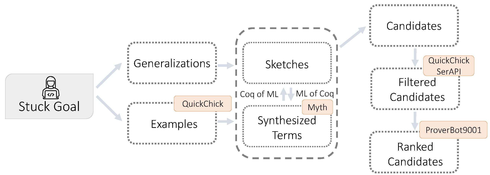

LFIND - Coq Lemma Synthesis Plugin
---------------------------

<p align="center">
  
  <br>
</p>

## Manual Installation

<details><summary><kbd>CLICK</kbd> to reveal instructions</summary>

These instructions were tested in macos and ubuntu.

`git clone --recurse-submodules https://github.com/AishwaryaSivaraman/lemmafinder.git`

Install the following software:

- opam 2.0.7
    - Download https://github.com/ocaml/opam/releases/download/2.0.7/opam-2.0.7-x86_64-macos and run `sudo install <downloaded file> /usr/local/bin/opam`
    - check installation using opam --version (it should say 2.0.7)
- opam update
- opam switch create 4.07.1+flambda
- opam repo add coq-released https://coq.inria.fr/opam/released
- opam install dune=2.7.1
- opam install core=v0.12.4
- opam install menhir=20200624
- opam install coq=8.11.2
- opam install coq-of-ocaml=2.1.0
- opam install coq-serapi=8.11.0+0.11.0
- opam install coq-mathcomp-ssreflect=1.11.0
- opam install coq-quickchick=1.3.2
- opam install parmap=1.2.3
- opam install base-bigarray
- opam install alcotest=1.4.0

- pip install matplotlib
- pip install tabulate


## Additional Setup
We need to setup the following packages before we can run lemmafinder.

### Proverbot
We use proverbot to check if the synthesized or generalized lemma is provable or can help prove the current stuck state.

1. `git clone --recurse-submodules https://github.com/UCSD-PL/proverbot9001.git`
    - git branch should point to master

2. For Mac users ONLY: In `Makefile` replace `cp dataloader/target/release/libdataloader.so src/dataloader.so` with `cp dataloader/target/release/libdataloader.dylib src/dataloader.so`.

3. mkdir proverbot9001/dataloader/.cargo

4. cd proverbot9001/dataloader/.cargo && vi config

5. Paste the following: `[target.x86_64-apple-darwin]
rustflags = [
  "-C", "link-arg=-undefined",
  "-C", "link-arg=dynamic_lookup",
]`


See https://pyo3.rs/v0.5.3/ for why we need this.

6. Comment lines 16-23 in `setup.sh`

7. Ensure you have git, opam, rustup, graphviz, libgraphviz-dev, python3.7, python3.7-dev and python3.7-pip installed.

8. run `make setup`

9. run `make download-weights`


### Myth
Myth is a Type-and-example-driven program synthesis engine. We use myth to synthesize expressions which are used in constructing useful lemmas.

1. `git clone git@github.com:AishwaryaSivaraman/myth.git`

2. make


### AST-Rewriter
Myth supports only a part of the ocaml syntax. We need a translator that takes in `.ml` file generated from Coq extraction to a format that is compatible/can parse with myth.

1. `git clone git@github.com:AishwaryaSivaraman/astrewriter.git`

2. dune build && dune install

### Lemmafinder
We are now ready to make this project.
Run `cd lemmafinder && opam config subst theories/LFindLoad.v && dune build && dune build && dune install`

### Environment Setup
In the folder that you run make or coqc export the following environment variable

```
export PROVERBOT=<path to proverbot folder>
export MYTH=<path to myth folder>/synml.native
export COQOFOCAML=/Users/<username>/.opam/4.07.1+flambda/bin/coq-of-ocaml
export REWRITE=<path to ast_rewriter>/_build/default/bin/main.exe
export LFIND=<path to lemma finder source>
```
</details>

## Lemma Synthesis

Synthesize a required helper lemma by invoking lfind as follows, making sure to only use *absolute* paths:
```
cd <path to lfind>
cd benchmark/motivating_example && make && cd ../../
python3 benchmark/run.py --prelude=<path to lfind>/benchmark/motivating_example --log_dir=<path to log directory> --getting_started
```

This should take ~5min and you should see the following synthesized lemma as the output of the script.
```
-----------------------------------------------
Run complete
Top Lemmas:
(cat 1) Lemma conj14eqsynthconj6 : forall  (lv0 : lst) (lv1 : nat), (@eq lst (rev (append lv0 (Cons lv1 Nil))) (Cons lv1 (rev lv0)))
(cat 2) Lemma conj6eqsynthconj3 : forall  (lv0 : lst) (lv1 : lst), (@eq lst (rev (append lv0 lv1)) (append (rev lv1) (rev lv0)))
(cat 2) Lemma conj10eqsynthconj5 : forall  (lv0 : lst) (lv1 : lst), (@eq lst (rev (append (rev lv0) lv1)) (append (rev lv1) lv0))
Runtime: 5.683333333333334 min
-----------------------------------------------
```

<details>
<summary><kbd>CLICK</kbd> for running lfind on a particular proof state.</summary>

## Running lemma finder on a particular proof state
<em> Note, the tool requires that the original project folder has run `make`</em>

To run ```lfind``` in a proof you need to add the following

```
Load LFindLoad.
From lfind Require Import LFind.
Unset Printing Notations.
Set Printing Implicit.
```

In the proof where u are stuck, add `lfind.` tactic and run `make` again in the folder.
If you want to obtain detailed debug logs for your run, use `lfind_debug` tactic instead. 

### Example:
1. cd `benchmark/bench_rev_append` && make.
This should first make the existing coq file.

2. Uncomment `lfind` in line 47.

3. Run `make`. If the setup is done correctly, this should run the lemma finder in ~30 min and at the end of the run you should see  `Error: LFIND Successful`. The output of this run is saved in `benchmark/_lfind_bench_rev_append`.
You can find the results of the run in `benchmark/_lfind_bench_rev_append/lfind_summary_log.txt`. You can find debug logs in `benchmark/_lfind_bench_rev_append/lfind_debug_log.txt`

</details>

## Evaluating lfind on a project

1. Make the project
  1. If your project already has a Makefile, just run `make`.
  2. Otherwise, collect your source files into a project with the test prefix:
  ```
  cd <projectdir>
  echo "-R . test" > _CoqProject
  find . -name "*.v" >> _CoqProject
  ```
  3. Create a makefile from that project:
  ```
  coq_makefile -f _CoqProject -o Makefile
  ```
  4. Run the makefile:
  ```
  make
  ```

2. Collect the lemma usages

`python3 benchmark/collect_stats.py --prelude=<full path to project> --project`

This script collects all locations in `lemmafinder_bench.txt` where an apply or rewrite tactic has been used. It also collects all theorems/lemmas in `lemmafinder_all_lemmas.txt`.

3. Run lemmafinder

Run the following:
```
cd <path to lfind>
python benchmark/run.py --prelude=<path to parent folder of the project> --log_dir=<path to log dir> --project --large --bench <project folder name>
```

This should run on the theorems that require helper lemma (logged in `lemmafinder_bench.txt` ) and output how many of were able to identify helper lemmas and amongst those how many were category 1 lemmas. You should find the output files in the --log_directory. 

## Evaluating lfind on benchmarks

1. You can find benchmark lemma synthesis locations in benchmarks/clam, benchmarks/lia, benchmarks/fulladder, and benchmarks/compiler.

2. Before running any of the benchmark, run `make` on each of the benchmark folders.

3. To generate lemmas, run the following:

```
cd <path to lfind>
python benchmark/run.py --prelude=cd <path to lfind>/benchmark --log_dir=<path to lfind> --large --bench "clam, lia, fulladder, compiler"
```
This command runs all benchmark locations and the output can be found in the log directory. 


<details>
<summary><kbd>CLICK</kbd> for note on external dependencies.</summary>

### Note on External Dependencies ###
External dependencies are not fully supported via dune for Coq-plugins. See https://github.com/coq/coq/issues/7698. To workaround this, we need to add external library dependencies (transitively) to src/dune and theories/dune and add the corresponding module to `Lfind.v`. See https://github.com/ejgallego/coq-plugin-template.

After this workaround, make sure that library.cmxs is visible in the current loadpath.
</details>

## Running OOPSLA-version of lfind

1. You can find the OOPSLA artifact VM [here](https://www.dropbox.com/sh/fkhl87holekyh0v/AAB5Zug7WXSf0OLpnZXXHNsUa?dl=0) with installation instructions. 

2. Further, you can find instructions to reproduce the results [here](https://docs.google.com/document/d/1C_A3wibNOLGsPv5Wytn_x3N3S6YpraK9kVPuWFYzZ9g/). 

Note that the VM works with a 15s timeout for Proverbot, which has a similar trend to the one reported in the paper with a 30s timeout.